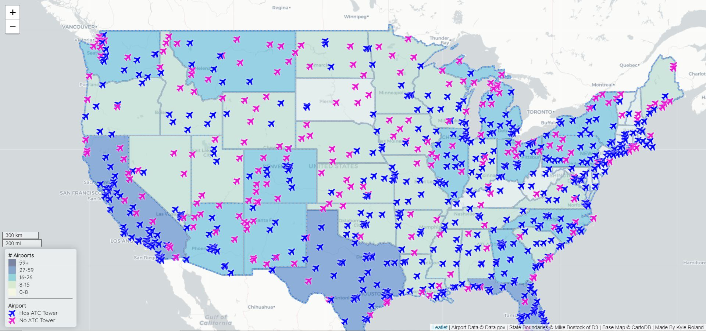
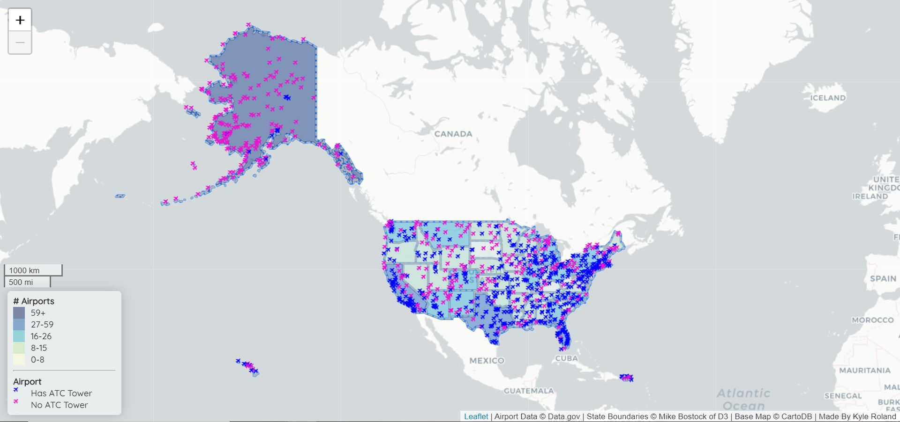

# United States Airports and ATC Towers

## Introduction

This project is an interactive web map of the Airport in the United States and its territories. States are colored based on the number of airports that they contain where darker blue states have more airports. Airports are eithe blue _(Has an ATC tower)_ or pink _(No ATC tower)_. Icons can be selected and will show the title of the airport. A legend detailing the above can be found on the bottom left along with a scale.

More information on the data sources and libraries used can be found below the two maps. _This project was created for GEOG 458 with Bo Zhao at the University of Washington_

## Project Map

#### Data Sources
- `airports.geojson` contains all the airports in the United States. It was converted from a shapfile found on [Data.gov](https://catalog.data.gov/dataset/usgs-small-scale-dataset-airports-of-the-united-states-201207-shapefile). Each airport has a `CNTL_TWR` property that shows if the airport has an ATC tower.
- `us-states.geojson` contains the boundaries for all of the states in the United States. The data can be attributed to [Mike Bostock](http://bost.ocks.org/mike) from D3js.org. Each state has a `count`property that is the number of airports in that state.

#### Libraries and Other Attributions
- `chroma.js` was used to dynamically generate a set of colors to be used for the color scheme in the choropleth map of states.
- `leaflet.js` was used to allow for quick deployment of a web map with interactivity.
- `jQuery` was used so for quicker development and better readability.
- Airport icons were found at [Font Awesome](https://fontawesome.com/?from=io).
